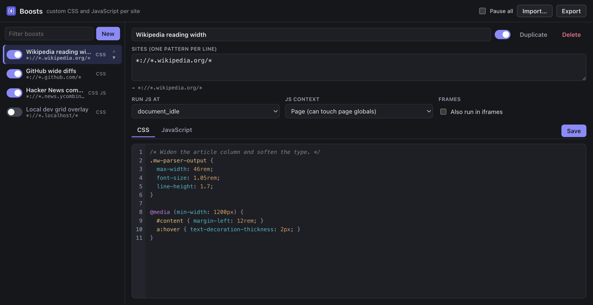
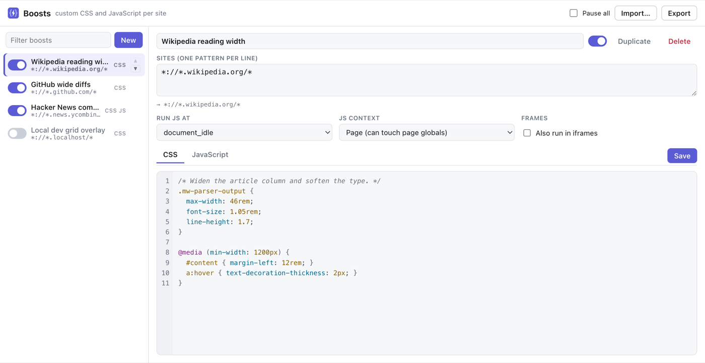
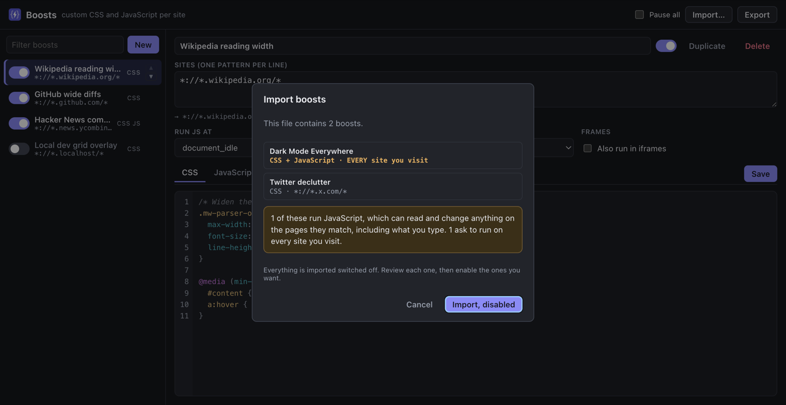

<div align="center">


# Boosts

### Every site has one thing you'd change.<br>Change it once, and keep it.

Per-site CSS and JavaScript for any Chromium browser.<br>
No account, no cloud, no build step, no dependencies.

<p>
  <a href="https://github.com/o-ba/boosts/actions/workflows/tests.yml"></a>
  
  
  
  
  
</p>

<p><a href="https://boosts.krawo.li"><strong>boosts.krawo.li</strong></a></p>



</div>

---

A docs page with a column too narrow to read. A sidebar you have never once looked at. A header
that follows you down the page, eating a third of the screen. A font two sizes too small on the
one dashboard you stare at all day.

You notice them every single day, and you fix them never. Fixing them means opening DevTools,
and DevTools forgets the moment you reload.

**Boosts remembers.** Write a snippet of CSS or JavaScript, point it at the sites it belongs to,
and it is applied every time you visit them. Then stop thinking about it.

## What it does

A **boost** is a snippet of CSS, JavaScript, or both, plus a list of the sites it runs on. That is
the whole model. Everything below is in service of making that quick to write and hard to get
wrong.

- **CSS and JavaScript**, per boost, with a real editor: line numbers, auto-indent, bracket
  completion and syntax highlighting for both languages.
- **CSS applies live.** Save and every open tab updates, with no reload. The popup previews it
  as you type.
- **Friendly site patterns.** Type `github.com`, get `*://*.github.com/*`. Type `localhost:3000`
  and the port is dropped for you, because match patterns already cover every port.
- **Everything autosaves**, because a popup is dismissed by clicking away and there is no chance
  to press a button.
- **Nothing leaves the browser.** No network calls of any kind: not for sync, not for
  telemetry, not for updates.

## Install

Boosts is not on the Chrome Web Store. Load it from source:

1. Clone the repository, or download it as a ZIP and unpack it.

   ```sh
   git clone https://github.com/o-ba/boosts.git
   ```

2. Open `chrome://extensions`.
3. Turn on **Developer mode**, top right.
4. Click **Load unpacked** and pick the folder you just cloned.

The manager opens by itself the first time.

Works in Chrome, Edge, Brave, Vivaldi, Arc and anything else Chromium-based, version 120 or newer.

### Enabling JavaScript

CSS works immediately. Chromium requires a separate opt-in before any extension may run user
JavaScript, and it is off by default even for unpacked extensions:

1. On `chrome://extensions`, open **Details** for Boosts.
2. Switch on **Allow User Scripts**.
3. Back in the manager, press **Re-check**.

The manager shows a banner with these steps until the toggle is on.

## Using it

### Popup

Click the toolbar icon, or press <kbd>Alt</kbd>+<kbd>Shift</kbd>+<kbd>B</kbd>. It edits the boost
that applies to the site you are looking at, previews CSS live as you type, and offers a new boost
pre-filled with the current host if nothing matches yet.

### Manager

**Manage** in the popup, or the extension's options page. Everything lives here: all boosts, site
patterns, run timing, JS context, ordering, import and export.

<div align="center">
  
</div>

### Pause all

Top right of the manager. Stops every boost without disabling them one at a time; the toolbar
badge shows a pause mark while paused.

This is the way out if a boost with a wide pattern breaks the pages you need. The manager is an
extension page, so no boost can reach it. It stays usable even when every site is broken.

## Site patterns

One per line. Friendly input is expanded into a Chrome match pattern, and the manager shows the
result underneath the field as you type.

| You type | It becomes | Matches |
| --- | --- | --- |
| `github.com` | `*://*.github.com/*` | github.com and all subdomains |
| `gist.github.com` | `*://*.gist.github.com/*` | that host and its subdomains |
| `example.com/docs*` | `*://*.example.com/docs*` | paths starting with `/docs` |
| `*.example.com` | `*://*.example.com/*` | unchanged, already a wildcard host |
| `localhost:3000` | `*://*.localhost/*` | localhost on any port |
| `https://news.ycombinator.com/*` | unchanged | full patterns pass through |
| `*` | `<all_urls>` | everything |

A bare host always includes its subdomains, which is what people usually mean.

Chrome match patterns have no port syntax, and a pattern without a port already matches every
port, so a typed port is dropped and the manager says so. Anything that cannot be rescued is
refused with a reason you can act on, `site names cannot contain spaces`, `"about:" pages cannot
be modified by any extension`, rather than being stored and failing silently later. An enabled
boost that ends up with no usable pattern is flagged in the list.

## Options per boost

| Option | Choices | Notes |
| --- | --- | --- |
| **Run JS at** | `document_start`, `document_end`, `document_idle` | CSS is always applied at `document_start`, so there is no flash of unstyled page |
| **JS context** | Page, Isolated | *Page* reaches page globals such as `window.app`. *Isolated* shares only the DOM |
| **Frames** | off by default | So boosts do not run inside every ad iframe |

Boosts are an ordered list, and that order decides which rule wins when two of them style the
same element. The arrows on each row change it.

## Import and export

**Export** writes every boost to a single JSON file. **Import** reads one back.

Import is the one path that ingests a file someone else wrote, so it is treated as such:
everything arrives **switched off**, and the manager shows what the file is asking for: How many
boosts, which sites, and whether any of them run JavaScript, before anything is written to
storage.

<div align="center">
  
</div>

## How it works

- The service worker turns each stored boost into `chrome.userScripts` registrations: one for the
  CSS at `document_start`, one for the JS at its own timing. They go in as separate `register()`
  calls, so a pattern Chrome rejects on one cannot take the other down, and one bad boost cannot
  take the rest with it.
- A resync registers the new set **before** removing stale ids, so a page loading while the
  service worker restarts is never left unstyled.
- CSS is injected as a `<style>` element that a `MutationObserver` re-attaches if the page removes
  it, which is what usually breaks naive userstyle injection on single-page apps.
- Your JavaScript is wrapped in an `async` function, so top-level `await` works the way it does in
  the DevTools console, and given a `//# sourceURL` so the console names it.
- Storage writes are serialised. Autosave fires them in bursts and each one is a
  read-modify-write of the whole list, so two overlapping saves would otherwise lose one.
- Saves are guarded by a revision counter, so an edit that lands mid-write stays queued instead of
  being marked as saved.
- Everything is in `chrome.storage.local`. `storage.sync` has an 8 KB per-item quota that CSS
  blobs blow straight through, so the export file is the way to move boosts between machines.

## The editor

A textarea with a line-number gutter, two-space indentation, auto-indent, bracket completion and
syntax highlighting for CSS and JavaScript, in light and dark.

Two things worth knowing:

- **<kbd>Tab</kbd> indents**, so it cannot also move focus. Press <kbd>Esc</kbd> first and the
  next <kbd>Tab</kbd> leaves the editor; typing anything puts <kbd>Tab</kbd> back to indenting.
- **No error checking.** Nothing here parses your code, it only colours it. A syntax error shows
  up in the page console at runtime, prefixed with `[Boosts]`.

## Development

```sh
sh tests/run.sh
```

194 assertions across five suites, run against macOS's built-in JavaScriptCore, so there is
nothing to install:

| Suite | Covers |
| --- | --- |
| `parse` | every source file parses |
| `patterns` | the normaliser rescues what it can and refuses the rest, checked against the inputs Chrome actually rejects |
| `highlight` | the tokenisers never alter the text they are given, and get token *types* right inside at-rule blocks |
| `store` | concurrent writes do not clobber each other; imported boosts can never arrive enabled |
| `registrations` | the registration loop, against a fake `chrome.userScripts` that validates match patterns the way Chrome does, including that a resync never drops below full coverage |

On Linux or Windows, swap the `JSC` path in `tests/run.sh` for any JavaScript shell with
`load()`, `readFile()` and `print()`.

## Limitations

- `chrome://`, `about:` and Chrome Web Store pages are off limits to every extension, so boosts
  cannot run there.
- `file://` boosts also need **Allow access to file URLs** in the extension's details.
- JavaScript injection depends on `chrome.userScripts`, which needs Chromium 120 or newer.
- No sync between machines. Use export and import.

## Security

Boosts requests `<all_urls>` because a per-site injector cannot know in advance which sites you
will want. Chrome summarises that permission as *"Read your browsing history"* on the details page.

What the extension does with it is all in this repository: about 3,000 lines of dependency-free
JavaScript, unminified, with no network access of any kind.

Boosts runs code you wrote, or code you imported. A boost set to the *Page* context can read and
change anything on the sites it matches. Treat an imported file the way you would treat a script
you were about to paste into the console, which is why import lands everything disabled and shows
you what it wants first.

## Contributing

Contributions are welcome and encouraged.

## License

[GNU General Public License v2.0](LICENSE).

----

<p align="center">
  Created with ❤️ by Krawoli in 2026
</p>

